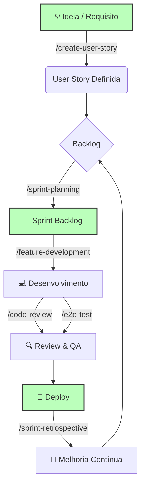

# 🚀 ScrumAIDev Agile Framework

**Desenvolvimento de Software Ágil Potencializado por IA**

> Um framework completo que guia times e agentes de IA ao longo de todo o ciclo Scrum — do refinamento ao deploy.

---

## 🗺️ O Ciclo de Vida Ágil com IA



---

## ⚡ Quick Start — Primeiros 5 Minutos

### Passo 1 — Instalar o framework no seu projeto

```bash
# Clonar como base de um novo projeto
git clone https://github.com/disciplabs/AgileAIDev_review.git meu-projeto
cd meu-projeto
```

### Passo 2 — Configurar o template de commit (recomendado)

```bash
git config commit.template .gitmessage
```

### Passo 3 — Inicializar com o agente de IA

No chat do seu agente compatível, digite:
```
/init-project
```

O agente criará a estrutura de pastas `docs/` e estará pronto para planejar.

### Passo 4 — Criar o primeiro planejamento

```
/sprint-planning
```

> **Resultado esperado:** com insumos suficientes, como um ZIP em `examples/figma/`, o agente pode gerar ou atualizar `docs/product_backlog.md` e criar `docs/sprints/sprint_planning_01.md` já na primeira rodada de planning.

---

## 🤖 Workflows — Guias de Processo por IA

Ative usando slash commands no chat do agente:

| Workflow | Quando usar | O que produz |
|---|---|---|
| `/init-project` | **Início de projeto** | Estrutura de pastas + reconhecimento de contexto |
| `/sprint-planning` | **Início da sprint** | `docs/sprints/sprint_planning_NN.md` com goal, stories e riscos; na primeira execução também pode gerar ou atualizar `docs/product_backlog.md` |
| `/create-user-story` | **Refinamento** | `docs/stories/US-XXX.md` com critérios INVEST completos |
| `/feature-development` | **Durante a sprint** | Branch + código + testes + PR |
| `/code-review` | **Antes do merge** | Relatório: arquitetura, qualidade, segurança, DoD |
| `/e2e-test` | **Antes do deploy** | Testes Playwright com Page Object Model |
| `/sprint-retrospective` | **Fim da sprint** | `retrospectives/sprint_NN_retro.md` + action items SMART |
| `/deploy` | **Release** | Checklist pré-deploy, smoke tests, tag de release |
| `/integrate-backend` | **Legado** | Análise e plano de integração de sistemas anteriores |

---

## 🎭 Skills — Personas da IA

As skills transformam o agente em um especialista para cada contexto. O agente as usa automaticamente conforme o workflow — ou você pode ativá-las explicitamente:

> *"Atue como [nome da skill] e..."*

| Skill | Persona | Especialidade |
|---|---|---|
| `architect` | Arquiteto de Software | Trade-offs, SOLID, Clean Arch, visão sistêmica |
| `backend-python` | Dev Backend Senior | FastAPI/Django, PostgreSQL, Neo4j, Pytest |
| `frontend-vue` | Dev Vue Senior | Vue 3, TypeScript, Vite, Pinia, Composition API |
| `react-expert` | Dev React Senior | React 18+, TypeScript, hooks, custom hooks, testes |
| `qa-engineer` | Engenheiro de Qualidade | Casos de teste, edge cases, validação de critérios |
| `security-expert` | Consultor AppSec | OWASP Top 10, auditoria, modelagem de ameaças |
| `story-refiner` | Product Owner Técnico | User stories INVEST, critérios de aceitação testáveis |
| `technical-writer` | Escritor Técnico | READMEs, API docs, manuais, release notes |

---

## 📂 Templates — Artefatos Ágeis Prontos

Copie e preencha — ou peça à IA para preencher por você:

| Template | Propósito | Usado pelo workflow |
|---|---|---|
| `product_backlog.md` | Mapa de funcionalidades e roadmap | `/sprint-planning` |
| `sprint_planning.md` | Compromisso da sprint (goal, stories, capacidade) | `/sprint-planning` |
| `user_story.md` | Especificação completa (Como/Quero/Para + AC) | `/create-user-story` |
| `task_breakdown.md` | Decomposição técnica de uma story em tasks | `/feature-development` |
| `definition_of_done.md` | Critérios de conclusão do time | `/code-review`, `/feature-development` |
| `retrospective.md` | Análise de sprint + action items SMART | `/sprint-retrospective` |
| `bug_report.md` | Padronização de reporte de erros | Manual |
| `postmortem.md` | Análise blameless de incidentes | Manual |
| `daily_standup.md` | Registro rápido de updates diários | Manual |

---

## Modelo de Maturidade

O AgileAIDev evolui por niveis, sem assumir stack fullstack no framework base:

| Nivel | Foco | Quando usar |
|---|---|---|
| 0 | Processo agil + agentes + templates | Todo projeto iniciado pelo framework |
| 1 | Spec/BDD/DoD governados | Mudancas de comportamento observavel |
| 2 | Contract-first documentado | APIs, eventos, webhooks, erros ou schemas compartilhados |
| 3 | Contract-first executavel | Quando houver validador ou runner real da stack |
| 4 | CI, mocks, tipos e testes de contrato | Quando o projeto derivado quiser automacao ponta a ponta |

O framework base fica leve nos niveis 0-2. Validadores, mocks, tipos gerados, Docker e testes de contrato pertencem ao projeto derivado e so entram quando registrados em `docs/project_manifest.md` e `docs/context.md`.

Regra rapida: docs/processo ficam no Nivel 0; comportamento observavel sobe para Nivel 1; boundaries tecnicos sobem para Nivel 2; runners reais ativam Nivel 3; CI com mocks/tipos/testes de contrato ativa Nivel 4. A politica completa esta em `docs/maturity_model.md`.

---

## 📐 Estrutura do Repositório

```
meu-projeto/
├── AGENTS.md                      ← Contrato de comportamento do agente de IA
├── CONTRIBUTING.md                ← Como usar e contribuir com o framework
├── .editorconfig                  ← Formatação consistente entre editores
├── .gitmessage                    ← Template de mensagem de commit
│
├── .agents/                       ← Infraestrutura do agente de IA
│   ├── rules/
│   │   └── coding-standards.md   ← Padrões de código aplicados automaticamente
│   ├── skills/                    ← 8 personas especializadas
│   └── workflows/                 ← 9 guias de processo (slash commands)
│
├── templates/                     ← Templates de artefatos ágeis e operacionais
│
├── examples/
│   └── figma/                     ← Designs/código legado para análise pelo agente
│
└── docs/                          ← Documentos canônicos + artefatos gerados
    ├── project_manifest.md        ← Estado atual do projeto e próxima leitura
    ├── token_budget.md            ← Política de leitura mínima de contexto
    ├── engineering_playbook.md    ← Visão geral do processo
    ├── maturity_model.md          ← Niveis 0-4 de adocao progressiva
    ├── context.md                 ← IDs, caminhos e comandos operacionais
    ├── git_workflow.md            ← Branch, commit, PR e merge
    ├── definition_of_done.md      ← Critérios canônicos de conclusão
    ├── decisoes_governanca_us_spec_bdd.md
    │                              ← Regra canônica de US, Spec e BDD
    ├── specs/                     ← Templates e specs governadas
    ├── contracts/                 ← Contratos documentados e adaptadores opcionais
    ├── bdd/                       ← Templates e cenários de comportamento
    ├── adr/
    │   └── readme.md              ← Guia de ADRs
    │
    └── (gerados após /init-project e /sprint-planning)
        ├── product_backlog.md
        ├── sprints/sprint_planning_NN.md
        ├── stories/US-NNN_*.md
        └── retrospectives/sprint_NN_retro.md
```


## 🎓 Exemplo de Uso: MPI Record

Veja o framework em ação com um exemplo real.

**O Cenário:**
O ZIP `examples/figma/MeetingFlow-MPI.zip` contém o código de um sistema de gravação de reuniões, sem documentação de planejamento já pronta.

**A Solução:**
1. ZIP adicionado em `examples/figma/`
2. Execute `/sprint-planning`
3. O agente analisa o código e gera ou atualiza os artefatos esperados do planejamento:

| Artefato Gerado | O que contém |
|---|---|
| `docs/product_backlog.md` | Epics, User Stories, Estimativas |
| `docs/sprints/sprint_planning_01.md` | Meta da Sprint, Seleção de tarefas, Riscos |

> Esses arquivos não precisam existir antes da execução. No template, eles aparecem como resultado do planejamento quando há contexto suficiente para gerá-los.

> Em menos de 2 minutos, código sem documentação vira um projeto ágil planejado. 🚀

---

## 🔗 Integração com Ferramentas

### Git
```bash
# Commit de artefatos de sprint
git add docs/sprints/ docs/stories/ docs/retrospectives/
git commit -m "docs: Sprint 05 artifacts"

# Tag de release
git tag -a v1.2.0 -m "Release Sprint 05: dashboard e relatórios"
```

### Jira / GitHub Issues / Trello
- Copie critérios de aceitação de `user_story.md` direto para issues
- Use o checklist de `docs/definition_of_done.md` como gate de merge

### CI/CD (quando disponível)
```yaml
# .github/workflows/quality-gate.yml
- name: Lint
  run: npm run lint
- name: Tests
  run: npm test -- --coverage
- name: E2E
  run: npx playwright test
```

---

## 📈 Métricas e Melhoria Contínua

Colete automaticamente com os workflows:

- **Velocity** — story points em `docs/sprints/sprint_planning_NN.md`
- **Qualidade** — bugs e cobertura em `docs/retrospectives/sprint_NN_retro.md`
- **Saúde do time** — seção de team health em `docs/retrospectives/sprint_NN_retro.md`

Analise tendências com a IA:
```
Analise as últimas 3 retrospectivas em docs/retrospectives/ e identifique:
- Padrões recorrentes
- Melhorias que funcionaram
- Action items não concluídos
```

---

## 🛠️ Customização

Todos os templates e workflows são **pontos de partida**. Adapte conforme necessário:

- **Novos templates** → adicione em `templates/`
- **Novos workflows** → adicione em `.agents/workflows/` com frontmatter YAML
- **Novas skills** → adicione em `.agents/skills/` com `SKILL.md`
- **Regras do agente** → edite `.agents/rules/coding-standards.md`

Consulte o `CONTRIBUTING.md` para o guia completo.

---

## ✅ Best Practices

**Faça:**
- Commite artefatos ágeis no git — o histórico é valioso
- Revise com IA, mas **decida com humanos**
- Mantenha templates atualizados nas retrospectivas
- Use os workflows do começo ao fim — os passos têm propósito

**Evite:**
- Preencher templates só por formalidade
- Copiar outputs de IA sem revisar
- Confiar 100% em estimativas de IA (use como referência)
- Tornar o processo burocrático demais

---

## ⚙️ Operating Model — Como Agentes Devem Operar

Para operação do agente:

1. Leia `docs/project_manifest.md`
2. Leia `AGENTS.md`
3. Selecione o workflow e a skill apropriados
4. Carregue apenas o contexto necessário (ver `docs/token_budget.md`)

Regra principal:
Use sempre o menor contexto suficiente. Expanda gradualmente quando necessário, conforme `docs/token_budget.md`.

NÃO leia o repositório completo, a menos que seja estritamente necessário.

---

## 📚 Recursos

| Recurso | Link |
|---|---|
| Guia de contribuição | [CONTRIBUTING.md](CONTRIBUTING.md) |
| Playbook de engenharia | [docs/engineering_playbook.md](docs/engineering_playbook.md) |
| Modelo de maturidade | [docs/maturity_model.md](docs/maturity_model.md) |
| Contexto operacional | [docs/context.md](docs/context.md) |
| Fluxo de branches | [docs/git_workflow.md](docs/git_workflow.md) |
| Governança US, Spec e BDD | [docs/decisoes_governanca_us_spec_bdd.md](docs/decisoes_governanca_us_spec_bdd.md) |
| Adaptadores de contrato | [docs/contracts/adapters.md](docs/contracts/adapters.md) |
| Decisões arquiteturais | [docs/adr/](docs/adr/) |
| Contrato do agente | [AGENTS.md](AGENTS.md) |
| Scrum Guide | https://scrumguides.org/ |
| User Stories | https://www.mountaingoatsoftware.com/agile/user-stories |

---


